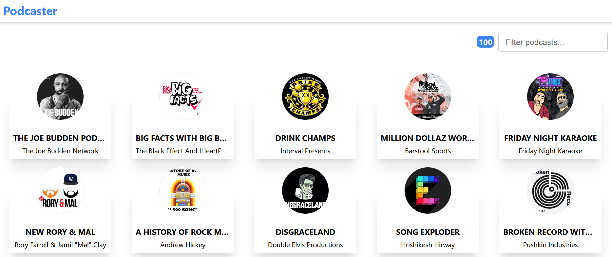

# iTunes Podcast Player

Una aplicación web construida con React y JavaScript que muestra y reproduce los 100 mejores podcasts de iTunes de manera eficiente y elegante.

## Información Técnica

### Características

La aplicación integra diversas tecnologías, bibliotecas y patrones de diseño avanzados, incluidos:

- [React Router Dom v6](https://reactrouter.com/): Utilizado para el enrutamiento de la aplicación.
- [Tanstack Query](https://tanstack.com/query/latest/) y [Axios](https://axios-http.com/): Para el manejo de datos asíncronos y la gestión de caché.
- [Context API](https://reactjs.org/docs/context.html): Para el manejo del estado global de la aplicación.
- [Date-fns](https://date-fns.org/): Utilizado para el formato de fechas y horas.
- [RSS-parser](https://www.npmjs.com/package/rss-parser) y [allorigins.win](https://www.allorigins.win/): Para el análisis y la obtención de información RSS de los podcasts.
- [Tailwind CSS](https://tailwindcss.com/) y [Material UI](https://mui.com/): Para el diseño y la implementación de la interfaz de usuario.

### En Desarrollo

- Diseño responsivo.
- Soporte para temas claros y oscuros.

## Instalación y Pruebas

Para probar la aplicación localmente en modo de desarrollo, sigue estos pasos:

1. Clona el repositorio en tu máquina local.
2. Ejecuta `npm install` en la raíz del proyecto para instalar todas las dependencias necesarias.
3. Ejecuta `npm run dev` para iniciar un servidor de desarrollo local. Se mostrará en la consola la dirección y el puerto para acceder a la aplicación.

Para el modo de producción, sigue estos pasos:

1. Ejecuta `npm run build` para crear una versión de producción de la aplicación, minimizando y concatenando los recursos. Esto generará una carpeta 'dist' en el directorio raíz que podrás usar para el despliegue en producción (ver el apartado "Demo" más adelante).

### Pruebas

Ejecuta `npm run test` para iniciar las pruebas E2E con Cypress.

## Demo

Puedes encontrar una versión en vivo de la aplicación [aquí](https://bejewelled-elf-efb60a.netlify.app/).

## Proyectos similar

- [Reproductor podcast personalizado - TypeScript](https://github.com/danviles/podcast-player)

## Autor

Creado por [Elvis Nogueiras](https://github.com/danviles).

Para cualquier pregunta o comentario, no dudes en contactarme a través de [LinkedIn](https://www.linkedin.com/in/elvis-nogueiras/).

---

© 2023 Elvis Nogueiras. Todos los derechos reservados.

---